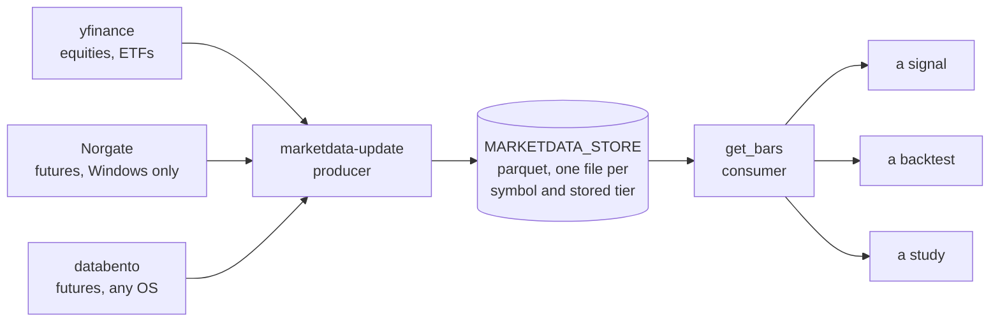
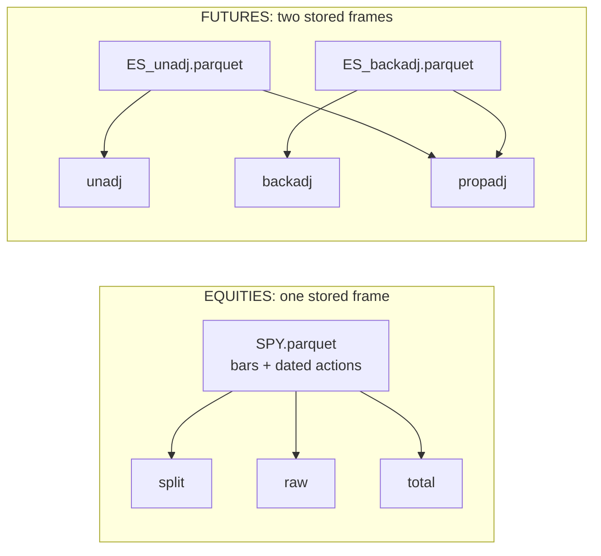
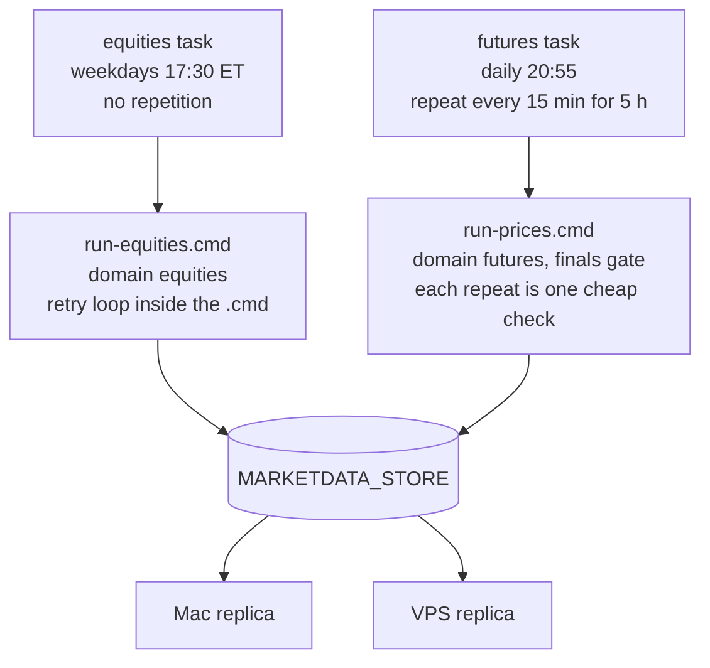
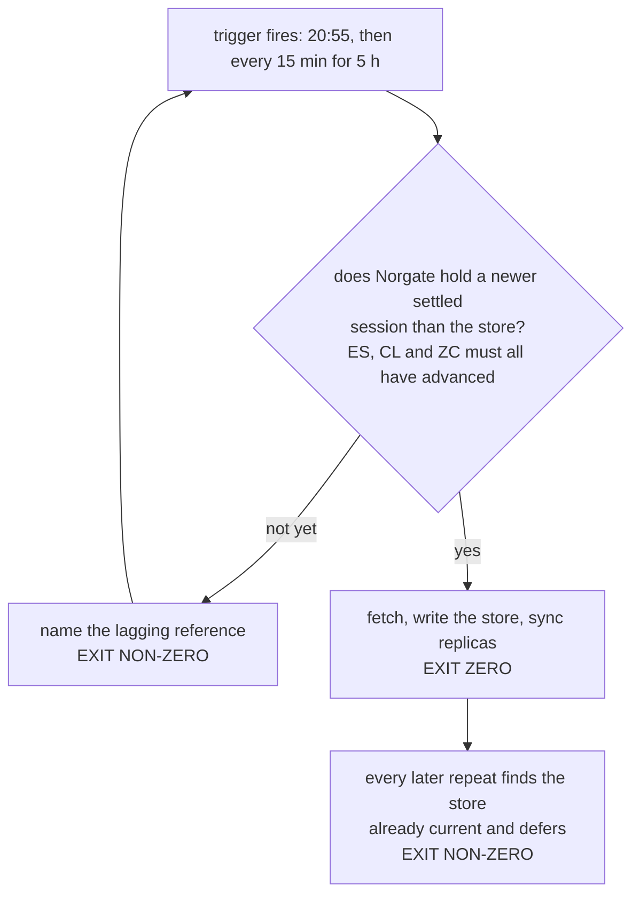

# marketdata

[](https://github.com/mspinola/marketdata/actions/workflows/python-test.yml)
[](https://github.com/mspinola/marketdata/actions/workflows/vendor-pin.yml)
[](pyproject.toml)
[](LICENSE)

Daily bars — equities, ETFs and futures — as a producer/consumer split over a
file-based store, with adjustment **derived on read wherever it can be**.

Sibling of [cotdata](https://github.com/mspinola/cotdata) and built on the same
design ideas, but deliberately a separate package. cotdata's registry requires a
`cftc_code` and equities have no COT report. See
[docs/design.md](docs/design.md) for the full reasoning and for everything about
each vendor's behaviour that was verified rather than assumed.

Futures arrived with ADR-0007, which makes cotdata CFTC positioning only and
moves every bar here.



Producers write, consumers only read, and reads never touch the network. The
store is the seam: everything above it is vendor-specific and runs on whichever
box can reach that vendor, everything below it is the same on every machine.

## Contents

| | |
|---|---|
| [Install](#install) · [Use](#use) | getting bars out |
| [Two domains, two adjustment axes](#two-domains-two-adjustment-axes) | the core model, **start here** |
| [Equity tiers](#the-three-equity-adjustment-tiers) · [Futures tiers](#the-three-futures-adjustment-tiers) | which series answers which question |
| [What a futures bar carries](#what-a-futures-bar-carries) | the columns, including the per-expiry ones |
| [Point-in-time reads](#point-in-time-reads-asof) | `asof=`, and why it is not `end=` |
| [Store layout](#store-layout) · [Environment](#environment) | where things live |
| [The Windows futures producer](#on-the-windows-futures-producer) | scheduling, the finals gate, the equities half |
| [Tests](#tests) · [Survivorship](#survivorship) · [Not built yet](#not-built-yet) | limits and caveats |

## Install

```bash
uv venv --python 3.11 && uv pip install -e ".[yahoo,dev]" "setuptools<81"
```

From an index, the distribution is **`crucible-marketdata`** and the import stays
`marketdata`:

```bash
uv pip install crucible-marketdata     # then: import marketdata
```

The two differ because `marketdata` is taken on PyPI by an unrelated, abandoned
project (`marketData` 0.2.0, last released 2020-04-19 — PyPI normalises both to the
same name). Same split as `python-dateutil` → `import dateutil`. **A dependency on
this package must name `crucible-marketdata`**, since that is what pip resolves;
depending on `marketdata` would fetch a stranger's 2020 module.

For the **databento futures producer** (any OS, and the only paid-API path here),
add the `databento` extra:

```bash
uv pip install -e ".[yahoo,databento,dev]" "setuptools<81"
```

On the **Windows futures producer**, add the `norgate` extra — nothing else pulls
`norgatedata`, and without it `--domain futures` stops before it fetches:

```bash
uv pip install -e ".[yahoo,norgate,dev]" "setuptools<81"
```

Installing it elsewhere does not help. It drives a locally installed Norgate Data
Updater rather than an API, and NDU is Windows-only, so every other machine reads
a synced store instead of producing one.

## Use

```bash
export MARKETDATA_STORE=~/code/marketdata_store
marketdata-update --bars                    # every registry symbol this box can produce
marketdata-update --bars --symbols SPY TLT  # scoped
marketdata-update --bars --domain equities  # skip futures (no Norgate on this box)
marketdata-update --metadata                # futures contract specs (Windows + Norgate)
marketdata-update --check                   # read-only summary, no network

marketdata-update --bars --domain futures --require-final   # only once Norgate has settled

marketdata-update --ingest-databento        # databento Stage 1 (PAID), any OS
marketdata-update --build-databento         # databento Stage 2 (FREE, offline)

marketdata-update --pin snap.json           # capture the store's state
marketdata-update --verify-pin snap.json    # prove it has not moved, exit 1 on drift
```

### Futures without Norgate: the databento producer

A box that cannot run Norgate — a Linux dashboard server, most obviously — can produce
futures bars from [Databento](https://databento.com/) GLBX.MDP3 instead. One provider
owns a symbol end to end (ADR-0006); a series is never blended.

```bash
export MARKETDATA_STORE=~/code/marketdata_store
export DATABENTO_API_KEY=db-...             # Stage 1 only
# optional: MARKETDATA_DATABENTO_RAW=/path  (default: _raw/databento under the store)

marketdata-update --ingest-databento --windowed-n1-stats   # Stage 1: PAID
marketdata-update --build-databento                        # Stage 2: FREE
```

**Two stages, and only one costs money.** Stage 1 pulls raw `.n.0`/`.n.1` `ohlcv-1d`
and `statistics` into an append-only raw store, resuming from each table's last fetched
date, so a re-run or a mid-pull failure pulls only what is missing. Stage 2 reads that
local store with no API and no network, so the back-adjustment can be iterated for free.
The raw store is producer-internal — keep `_raw/` out of any sync to consumers.

`--windowed-n1-stats` fetches the second contract's statistics only around roll dates.
Its settlement is read only at rolls, so this drops the largest avoidable download with
no accuracy loss; worth it on a cold-start backfill.

**Not a Norgate replacement.** History starts at the GLBX floor (2010-06-06) against
Norgate's decades, and eight registry markets are not on CME Globex at all — the ICE
softs, lumber and the dollar index carry `databento: null` and are skipped rather than
paid for. Local research stays on Norgate.

**If the resume ledger and the disk disagree**, `--reconcile-databento` repairs both
directions from local files: it records tables an interrupted run left unrecorded, and
prunes entries whose parquet is missing. The second is the one that matters — such an
entry still carries a current `last_date`, so a restart skips it as "already current"
and leaves a permanent hole in a paid dataset with no error anywhere.

Both vendors land in the same store under different paths
(`bars/futures/norgate/` beside `bars/futures/databento/`), which is what makes
`scripts/validate_databento_vs_norgate.py` a single-store comparison.

**Scheduling it:** [docs/LINUX_SCHEDULING.md](docs/LINUX_SCHEDULING.md) — the wrapper, the
crontab line, why the cold-start backfill is not the nightly job, and what to do when the
resume ledger and the disk disagree.

### Pinning a store for a study

A study that quotes numbers is only reproducible if the data behind them is
identifiable, and `--bars` rewrites every symbol's `updated_at` while Yahoo restates
adjusted history whenever a dividend lands. So the same command against the same path
can produce different figures on different days.

`--pin` captures row counts, date spans, source and `updated_at` per symbol.
`--verify-pin` compares them and exits non-zero naming every field that moved. Commit
the snapshot next to the study that depends on it.

A snapshot is **evidence, not configuration**. If verification fails, the honest
response is to say which figures are now unreproducible, not to re-pin and move on.

```python
from marketdata import get_bars

px = get_bars("TLT", "total", start="2010-01-01")
```

## Two domains, two adjustment axes

The domain a symbol belongs to decides which tiers it has, and `get_bars`
resolves it from the registry rather than taking it as an argument. Asking for a
futures tier on an equity — or the reverse — raises a message naming the right
ones.

| Domain | Tiers | Stored | Derived on read |
|---|---|---|---|
| `equities` | `split`, `raw`, `total` | one frame | all three |
| `futures` | `backadj`, `unadj`, `propadj` | **both** `backadj` and `unadj` | `propadj` |

Equities derive everything because corporate actions arrive as dated events
alongside the bars. Futures cannot: Norgate's back-adjustment is roll splicing it
performed itself, and the stitched calendar spread at each roll appears in no
other series, so `backadj` and `unadj` are two separate stored facts.



Read the arrows as "can be computed from". The asymmetry is the whole reason
futures grew a tier component in the store path: one arrow into `split`, `raw`
and `total` because a dividend is a dated event you can re-apply at will, but
**two** arrows into `propadj` because a roll spread is not recoverable from
either stored series alone. That is why the futures producer writes both tiers or
fails the symbol, and why a read that finds one raises instead of returning
empty.

## The three equity adjustment tiers

The store holds one frame per equity symbol exactly as the vendor serves it, plus
the dated action columns. Yahoo's `Adj Close` is **not** stored: it is restated
every time a new dividend lands, so a backtest pinned to it is not reproducible.
Raw bars plus dated actions are immutable facts, and `marketdata.adjust` rebuilds
any tier from them deterministically.

| Tier | Splits | Dividends | Use |
|---|---|---|---|
| `split` (default) | applied | no | continuous price series, price-based signals |
| `raw` | un-applied | no | as-traded. Price-level logic, or an engine that models dividends itself |
| `total` | applied | reinvested | any hold spanning an ex-date, where the return is what you measure |

This is not a cosmetic distinction. TLT over its full history returns **+2.1%** on
the price series and **+132.3%** on total return.

## The three futures adjustment tiers

| Tier | What it is | Use |
|---|---|---|
| `backadj` (default) | additive back-adjustment, as Norgate computes it | signals and stops. Preserves absolute daily price *changes* |
| `unadj` | raw front-month, real spread gaps at each roll | absolute price level, point-value sizing |
| `propadj` | ratio back-adjustment, derived from the two above | volatility and any percent return |

One real roll makes the difference concrete. Lean hogs went from the April to the
June contract over the weekend of 11 to 14 April 2025:

```text
                                        Fri 11 Apr   Mon 14 Apr        the day's move
  front contract                            202504       202506
  unadj      as traded                       85.43        95.12    +9.70    +11.35%
  backadj    spread removed, SHIFTED         76.00        77.80    +1.80     +2.37%
  propadj    spread removed, SCALED          77.24        78.73    +1.49     +1.93%
```

The `unadj` row is the trap: an eleven percent overnight move that nobody made,
because it is the April/June calendar spread rather than a price change. Both
adjusted rows remove it, and they differ in HOW. `backadj` subtracts the spread,
which keeps the point move honest and drags the level away from anything
tradeable. `propadj` divides it out, which keeps the percentage honest and
rescales the level instead.

The three disagree only on the 2.7% of bars that are roll days. On the other
97.3%, measured across HE's full history:

- `propadj` percent returns are **identical** to as-traded, to 6e-8, which is
  float32 storage precision. Ratio adjustment scales a segment by one constant,
  and a constant cancels out of a ratio.
- `backadj` percent returns are off by a **median of 0.894 percentage points per
  day**, because the level it divides by is not a price.

`propadj` is not an optional refinement. Additive adjustment accumulates roll
gaps downward, and across the cotdata store **52.3% of ZS's back-adjusted closes
and 41.2% of DC's are non-positive** — a percent return or an R-multiple is
meaningless on those. Ratio adjustment preserves percentage returns. It does not
make the series strictly positive: it scales by a positive factor, so it keeps
the underlying's sign, and CL prints −24.11 on 2020-04-20 because WTI really
settled at −37.63. That is one bar out of the whole store.

Because `propadj` needs both stored tiers, **the futures producer writes both or
neither**, and a read that finds only one raises instead of returning empty. A
half-stored symbol is worth being loud about: additive back-adjusted percent
volatility comes out ~200x too high for soybeans and 0.47x for gold, and 0.47x
passes every implausibility screen a spot check would apply.

## What a futures bar carries

Every stored futures frame, both tiers, carries these columns. Three of them name
the actual expiries behind the continuous series, which is the only per-contract
information the store holds.

| Column | What it is |
|---|---|
| `Open` `High` `Low` `Close` | settlement-close OHLC at the requested tier |
| `Volume` | whole-market volume across the curve, as Norgate reports it, or the two-expiry series if `volume="reconstructed"`. The parameter names invert: see below |
| `Open Interest` | whole-market open interest, NOT front-month. Norgate's exchange-collected figure, and it agrees with the CFTC's independently collected clearing-member total to four decimal places |
| `Delivery Month` | the expiry that is front on this bar, as `YYYYMM`. Changes exactly at a roll, which is what makes roll detection semantic rather than a guess at the offset |
| `FirstContract` `SecondContract` | the two highest-volume expiries trading that day, by Norgate symbol (`HE-2026V`) |
| `FirstVolume` `SecondVolume` | their volumes |
| `Volume_Reconstructed` | `FirstVolume + SecondVolume`, or the plain `Volume` series where individual contracts were unavailable |
| `Volume_Source` | `reconstructed` or `raw`, so the fall-back rows can be excluded |

**Both count columns are whole-market, and both names point the other way.**
`volume="front"` and the `Open Interest` label read as front-month and neither is:
`front` spans the whole curve, while `reconstructed` sounds fuller and is
`FirstVolume + SecondVolume`, exactly two expiries. Measured on the current store,
median of `reconstructed / front` over the last 1,500 bars: **0.55 in NG, 0.59 in
CL, 0.67 in HE, 0.77 in ZC**, so the narrower series understates most in the
markets with the deepest curves. It reaches 0.97 in the metals (GC, SI) and 1.00
in ES, where the curve is effectively two contracts anyway.

Open interest is settled by an outside check rather than by inference. Norgate
collects it from the exchange and the CFTC collects its own from clearing members,
so the two are independent measurements of the same quantity, and on the COT
report Tuesday they agree: **median ratio 1.0000 on 14 of 14 spot-checked
markets**, over ~24,000 pairs, with a zero interquartile range on 12 of the 14 (6E
is the loosest at an IQR of 0.0045, PA at 0.0001). Two collection paths cannot
agree that precisely on anything but the whole market. Front-month would be a
fraction. This has now been measured three times, most recently across the full
41-market npf universe, where the per-market median ratio spans 0.9999 to 1.0000
on 41 of 41; see `cotdata/docs/design/reading-the-store.md` §4 for the first of
them.

```python
import marketdata, cotdata, pandas as pd

oi = marketdata.get_bars("CL", "unadj")["Open Interest"].dropna()
cftc = cotdata.get_cot("CL")["Open_Interest_All"].dropna()
cftc.index = pd.to_datetime(cftc.index)
idx = oi.index.intersection(cftc.index)
print(len(idx), (oi[idx] / cftc[idx]).median())        # 1926 1.0
```

The whole-market reading is a fact about the **Norgate** producer, which is the one
that writes this store. The databento producer takes open interest from the `.n.0`
continuous contract's own statistics (`stat_type` 9), so its `Open Interest` is that
contract's, not the market's. Do not carry the agreement above across vendors.

**There is no per-expiry OHLC in the store, and that is a storage decision rather
than a vendor limitation.** The producer enumerates every individual contract and
calls `norgatedata.price_timeseries` on each one, which returns full bars; it then
keeps `Date`, `Volume` and `Symbol` and discards the rest
(`providers/norgate.py`). So the contract NAMES are stored and their PRICES are
not. Anything needing a calendar spread, a same-delivery-month seasonal study, or
a check of whether a continuous signal survives on the contract you would actually
trade is blocked on that selection, not on the subscription.

## Point-in-time reads: `asof=`

```python
get_bars("HE", "propadj", asof="2015-06-30")   # the series as it stood that day
get_bars("HE", "propadj", end="2015-06-30")    # today's series, truncated
```

Reproducing the table below:

```python
import marketdata
a = marketdata.get_bars("HE", "backadj", asof="2015-06-30")["Close"]
e = marketdata.get_bars("HE", "backadj", end="2015-06-30")["Close"].reindex(a.index)
roc = lambda c: c.pct_change(20) > 0.10
x, y = roc(a), roc(e)
m = x.notna() & y.notna()
print(int((x[m] != y[m]).sum()), "of", int(m.sum()))   # 2314 of 9237
```

These are different, and the difference is not small. Additive back-adjustment
re-anchors to whatever contract is front NOW, so every past price shifts on every
roll. `end=` truncates today's restated series; `asof=` also removes the
cumulative spread of every roll since, returning the prices that were actually on
a screen that day. For HE at a June-2015 as-of, the two differ by a constant
43.925.

It matters only for RATIO-based logic, and there it matters a lot:

| signal on HE, today's series vs the June-2015 vintage | days differing |
|---|---|
| 50/200 moving-average cross | 0 of 9,237 |
| 20-day breakout | 0 of 9,237 |
| more than 5% above the 200-day mean | 1,969 (21.3%) |
| 20-day ROC above 10% | 2,314 (25.1%) |

A constant offset cancels out of a comparison between two points on one series and
does not cancel out of a ratio between them. So a moving-average system is immune
to this and a percent-threshold system is not, and a quarter of the ROC signals a
backtest sees on hogs were not visible when they supposedly fired.

The vintage is exact, not approximate: the offset is piecewise constant and steps
only at rolls (measured: zero non-roll movement across 11,714 HE bars), so
re-anchoring is one subtraction. `unadj` does not restate at all, so an `asof`
read of it is a plain truncation.

**Futures only.** On equities it raises. The equity vintage is a different
derivation rather than the same one with a different date, because stored yfinance
OHLC is already split-adjusted using every split including those after the as-of
date. Refusing beats ignoring the argument: silently returning today's series for
a point-in-time request is the failure the parameter exists to prevent.

## Store layout

```
$MARKETDATA_STORE/
  bars/<domain>/<source>/<symbol>.parquet          # equities — one stored frame
  bars/<domain>/<source>/<symbol>_<tier>.parquet   # futures  — one per stored tier
  metadata/contract_specs.parquet                  # futures point value, tick size, margin
  manifest.json
  _raw/databento/                                  # PRODUCER-INTERNAL, do not sync
```

The leading underscore marks `_raw/` as not a consumer domain. It holds databento's
append-only bronze store — the paid Stage-1 landing area that Stage 2 rebuilds from —
and it is both the largest thing in the store and useless to a reader. Exclude it from
any sync.

The vendor is part of the **path**, not just the manifest. Yahoo and Norgate overlap
almost completely on equities and ETFs and do not store the same columns, so a single
`bars/<symbol>.parquet` would let whichever producer ran last silently win. The domain
sits above it because futures and equities have entirely different adjustment axes, so
their frames are not interchangeable even when symbol strings collide. Separate
directories also make a vendor A/B comparison possible:

```python
get_bars("SPY", "total", source="yfinance")
get_bars("SPY", "total", source="norgate")
```

Omit `source=` and the registry resolves one for this deployment. A symbol missing under
the resolved vendor but present under another raises rather than returning empty, because
silently substituting a vendor is what ADR-0006 forbids.

## Environment

| Var | Meaning |
|---|---|
| `MARKETDATA_STORE` | the store root. Required. Reads and writes both guard on it |
| `MARKETDATA_REGISTRY` | override the packaged `registry.yaml` |
| `MARKETDATA_PRICE_SOURCE` | deployment default vendor, `yfinance` if unset. Futures ignore it — only Norgate serves them |
| `MARKETDATA_NO_NETWORK` | skip the network tests |

The store root may share a parent folder with cotdata's, but the two must not
share a `manifest.json`. Both producers do a read-modify-write on it.

### On the Windows futures producer



Two tasks, not one, and the separation is load-bearing rather than tidy: see
[Scheduling the equities half](#scheduling-the-equities-half) for the three
independent reasons. Note where the retry lives in each. The futures half retries
via a **repeating trigger**, because its gate can defer cheaply and fall through;
the equities half retries **inside its wrapper**, because it has no cheap defer
to fall through to and a repetition would re-fetch every symbol and re-run both
replica syncs after a success.


That box now runs **three scheduled producers** across two packages, so it needs **both** store variables set at
once, pointing at **different roots**. This is new with the futures domain: until
ADR-0007 moved bars here, `COTDATA_STORE` alone was the whole story.

```cmd
setx COTDATA_STORE    C:\Users\YourUsername\cotdata_store
setx MARKETDATA_STORE C:\Users\YourUsername\marketdata_store
```

`setx` persists; plain `set` lasts only for the current Command Prompt, which is
the usual reason a scheduled task cannot find a store an interactive shell could.
Open a NEW prompt afterwards — `setx` does not affect the one you typed it in —
and verify:

```cmd
echo %COTDATA_STORE%
echo %MARKETDATA_STORE%
marketdata-update --check
```

`--check` reads the manifest and no network, so it is the cheap confirmation that
the variable points where you think. An unset variable is refused by name rather
than defaulted, because a silent default would write a second store somewhere
nobody looks.

**Do not point them at one root.** Sharing a parent folder is fine and makes the
pair easy to sync; sharing a root is not, because both packages keep a
`manifest.json` at their root and each does a read-modify-write on it, so the two
producers would eventually drop each other's entries.

Python, virtualenv and Task Scheduler setup are identical to cotdata's and are
not duplicated here — see
[cotdata's Windows setup guide](https://github.com/mspinola/cotdata/blob/main/docs/WINDOWS_SETUP.md).
The only marketdata-specific pieces are the `norgate` extra in **Install** above,
the two variables here, and the finals gate below.

### Waiting for Norgate's Finals



> [!IMPORTANT]
> **A healthy night ENDS on a non-zero exit.** The capture happens on one repeat
> and every repeat after it defers, so the task's Last Result is the defer, not
> the capture. A deferred run and a genuinely failed run look identical from the
> scheduler. **Judge a nightly run by the store, never by Last Result.**


Schedule the nightly futures run with `--require-final`:

```cmd
marketdata-update --bars --domain futures --require-final
```

Norgate's Final futures prices land in the evening, but the Norgate Data Updater
still has to *pull* them on its next poll. `--require-final` fetches only once
Norgate holds a **newer settled session than the store already does** (checked
across `ES`, `CL` and `ZC`, all of which must have advanced). Until then it prints
which reference is lagging and **exits non-zero**.

Give the task's **trigger a repetition** — fire at 20:55, then repeat every 15 minutes
for 5 hours. That turns "fire at 9pm" into "run the moment the Finals land": each repeat
is one short date comparison that defers immediately until they do, and on a weekend or
holiday the window simply closes, harmlessly.

```bat
schtasks /Create /TN "marketdata bars" /TR "<DIR>\run-prices.cmd" /SC DAILY /ST 20:55 /RI 15 /DU 0005:00
```

> [!WARNING]
> **Not "if the task fails, restart every N minutes."** This page used to recommend that,
> and it was wrong in production. That setting covers the scheduler failing to *launch* the
> action — it does **not** fire on a non-zero exit code from your script. A run whose action
> returns 1 is recorded as event 102, *"Task Scheduler successfully finished"*, and no
> restart is scheduled.
>
> Measured on the reference box, which had `RestartCount 20` / `RestartInterval PT15M` set
> on the bars task: from 2026-08-12 to 08-15 the action returned exit 1 (a `--require-final`
> defer) and the task was launched **exactly once each night** — four consecutive nights, no
> retry, no bars captured. Events 111 and 322–324, the restart and queue events, never
> appeared at all.
>
> The failure stayed invisible because the gate self-heals: a missed night is captured by
> the next run that finds Norgate ahead of the store, so the data was never permanently
> wrong, only a day late, and `--check` a week later looked fine.

A repetition fires on schedule regardless of what the previous run returned, which is
exactly what a poll needs. `schtasks` sets it with `/RI` (interval, minutes) and `/DU`
(duration, `HHHH:MM`); `/Change` converts an existing task in place. In the GUI it is on the
**Triggers** tab — *"Repeat task every…"* — not the **Settings** tab, which is where
restart-on-failure lives. Full detail, including why the duration is picked from when the
source could plausibly arrive, is in
[cotdata's scheduling guide](https://github.com/mspinola/cotdata/blob/main/docs/WINDOWS_SCHEDULING.md#polling-with-a-repeating-trigger).

The gate is **opt-in and futures-only**. Without the flag the run is unconditional
as before; with `--domain equities` it is refused rather than ignored, because
yfinance has no settled-versus-interim distinction to gate on. `--final-cutoff` is
accepted and ignored, so a scheduler carrying cotdata's flag does not break: the
gate compares data, not clocks, and [docs/design.md](docs/design.md) records why
(cotdata's fixed cutoff deferred every attempt on 2026-07-27, when Norgate
published at 8:49pm against a 20:55 threshold).

If the bars task is currently **chained behind cotdata's `run-prices.cmd`** with an
`ERRORLEVEL` guard, cotdata's gate has been protecting this one. That still works;
the flag makes the task correct on its own, so the chain becomes a convenience
rather than the only thing standing between the store and an unsettled bar.

### Scheduling the equities half

**Equities get their own task, not a step appended to the futures wrapper.** Three reasons,
any one of which is sufficient:

1. **The futures wrapper exits early by design.** `run-prices.cmd` carries the
   `--require-final` exit code straight out, so once the futures half has captured, every
   later repeat exits at line one. Anything chained behind it is unreachable on those
   repeats — equities would get exactly one attempt per night, with the repetition trigger
   above providing no retry for it at all.
2. **The two halves fail differently.** `--bars --domain equities` reports ok only when
   `failed == 0`, so one flaky Yahoo symbol fails the whole run. Chained behind the futures
   fetch, that transient would abort the replica syncs and strand the futures bars written
   that night on the producer. One vendor's hiccup should not hold the other vendor's good
   data hostage.
3. **Yahoo needs no finals gate.** The session's daily bar is available shortly after the
   16:00 ET close, so this runs at 17:30 ET and is finished — retries included — before the
   20:55 futures task starts. Both wrappers end by mirroring the same replicas, and two of
   those running concurrently is a race nobody wants to debug.

```bat
schtasks /Create /TN "marketdata equities" /TR "<DIR>\run-equities.cmd" /SC WEEKLY /D MON,TUE,WED,THU,FRI /ST 17:30
```

**No `--require-final`** — the gate is futures-only and is *refused* here rather than
ignored (`update.py` exits 2). yfinance publishes no settled-versus-interim distinction, so
there is nothing to gate on. The protection comes from cadence instead: the provider fetches
`period="max"` and `write_bars` replaces the whole parquet, so every run restates the full
history and a provisional bar captured today is overwritten tomorrow. **That self-healing is
why this task must be daily rather than weekly or monthly** — the store keeps no per-bar
record of whether a value was provisional, so on a monthly cadence a bad capture would sit
there unmarked for a month.

**No `--metadata`** either: that fetches *futures* contract specs from Norgate, and the
futures task already runs it nightly.

**Put the retry inside the wrapper, not on the task** — see the warning above for why Task
Scheduler's restart-on-failure cannot do it. A repetition trigger is also the wrong shape
here: with no `--require-final` gate to defer cheaply, every repeat after a success would
re-fetch every symbol and re-run both replica syncs. A short retry loop around the fetch
alone is what you want; there is a worked template at
[cotdata's `docs/examples/windows/run-equities.cmd`](https://github.com/mspinola/cotdata/blob/main/docs/examples/windows/run-equities.cmd).

## Tests

```bash
.venv/bin/python -m pytest tests/ -q -m "not network"
```

```bash
.venv/bin/python -m pytest tests/ -q
```

CI runs the first form on every push and PR across Python 3.10 to 3.14. The network
tests are **not** part of that gate. They run weekly in a separate `vendor-pin`
workflow, because their result depends on a third party rather than on this code: a
change in Yahoo's adjustment convention is worth hearing about within a week, but is
never a reason to block an unrelated PR.

`tests/test_pin.py` is the load-bearing one. It reconstructs Yahoo's own
`Adj Close` from `Close + Dividends` across five symbols and asserts the match to
1e-4. That test is what earns the right to drop the restated column from the
store. It also asserts the pin set contains split-heavy names, because TLT and SPY
have never split and would pass even with a double-applied-split bug.

## Survivorship

Every registry symbol is currently listed. yfinance cannot serve delisted
securities or point-in-time index membership, so **this is not a point-in-time
universe and must never be treated as one**. Fine for liquid ETFs, a hard ceiling
for a broad equity study. Norgate US Stocks fixes it, but only at Platinum and
above.

## Not built yet

The RealTest CSV exporter, pending verification of RealTest's current data-import
layout. The intent is a pure projection: parquet stays authoritative, CSV is
regenerated, and the export records which store state fed it.
